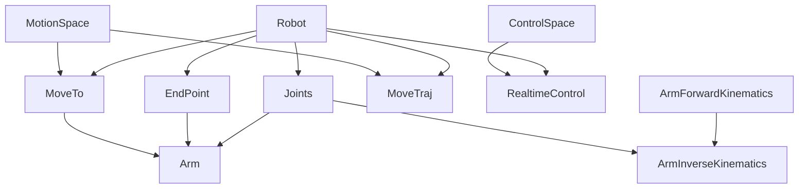

# 能力模型

`robot_behavior` 的设计不是“一个大 trait 解决所有问题”，而是把能力拆成可组合的小 trait。

## Trait 分层



## 核心原则

- 生命周期与能力分离：`Robot` 只表达所有设备共有的生命周期。
- 模型参数是关联常量：关节限位、末端限位、DH 参数都属于机器人型号。
- 命令语义由类型表达：`JointSpace<N>`、`TorqueControl<N>` 这类 marker 类型用于消除运行时分支歧义。
- 用户入口由 blanket trait 提供：`Motion` / `Control` 不需要驱动实现，只负责把调用转发到具体 `MoveTo` / `RealtimeControl` impl。

## Root re-export

`lib.rs` 会把主要公共项重导出到 crate 根：

```rust
use robot_behavior::{Robot, Joints, EndPoint, Arm, Pose, JointSpace};
```

也提供 `robot_behavior::behavior::*` 作为更窄的行为 prelude，便于驱动项目统一导入。

## 与旧接口的区别

旧文档中的 `MotionType`、`ControlType`、`RobotBehavior`、`ArmBehavior` 属于旧模型或 FFI 迁移残留，不是当前主线 Rust API。新文档统一使用：

- `Robot`
- `MoveTo<S>` / `MoveTraj<S>`
- `Motion`
- `RealtimeControl<S>` / `Control`
- `Arm<N>`
